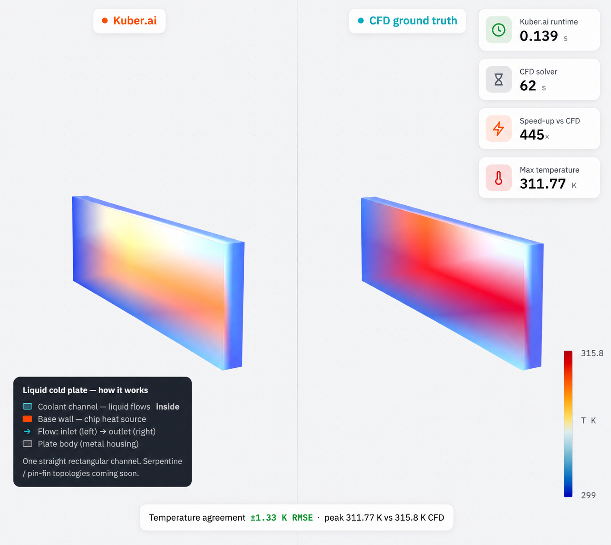
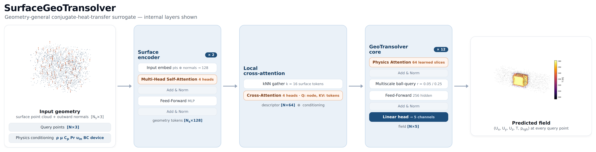

<div align="center">

# Kuber

**An open framework for conjugate–heat-transfer AI — build, train, and operate neural surrogates for any coupled fluid–heat problem.**

The full stack, from physics-data generation to a deployable, geometry-general surrogate — for **any coupled fluid–heat (conjugate heat transfer) problem**: heatsinks, cold plates, heat exchangers, power electronics, battery packs, HVAC, turbomachinery cooling. First domain with published results: **electronics cooling**, where Kuber beats the previous best on the SIMSHIFT heatsink benchmark with no domain adaptation.

[](https://shubhjain007.github.io/Kuber/demo.html)
[](https://shubhjain007.github.io/Kuber/)
[](paper/kuber.pdf)
[](https://colab.research.google.com/github/ShubhJain007/Kuber/blob/main/notebooks/quickstart.ipynb)
[](LICENSE)
[](https://www.python.org/)
[](https://pytorch.org/)
[](https://github.com/NVIDIA/physicsnemo)

</div>

**Kuber prediction vs. CFD ground truth.** A heatsink (temperature agreement ±2.11 K) and a liquid cold plate (±1.33 K, 445× faster than the CFD solver):




> **Read the [technical report (PDF)](paper/kuber.pdf).** The [project page](https://shubhjain007.github.io/Kuber/) and an [interactive ground-truth-vs-prediction viewer](https://shubhjain007.github.io/Kuber/demo.html) (3D solid geometry + fluid field, heatsink & cold plate) are served from **GitHub Pages**.

## Key Features

- **Geometry-general.** SurfaceGeoTransolver ingests raw boundary geometry — a surface point cloud with normals — and predicts the full field `(Uₓ, U_y, U_z, T, p_rgh)` at any query point. No analytic signed-distance field, so it works on arbitrary CAD.
- **State of the art, no domain adaptation.** 12.14 K temperature RMSE on the public SIMSHIFT heatsink out-of-distribution split — beating the previous published best (UPT, 12.41 K) — while every baseline relies on unsupervised domain adaptation and Kuber uses none.
- **One model, many device classes.** Heatsinks (wall-temperature BC, buoyancy-driven, air) and cold plates (heat-flux BC, forced liquid) from a single set of weights, distinguished only by a device flag and physics conditioning.
- **Reproducible data engine.** Parametric geometry → OpenFOAM `buoyantSimpleFoam` → per-node `.npz`, resumable, convergence-gated, mesh-convergence-verified, and license-clean (0 cases from any external source).
- **Honest evaluation harness.** Per-field normalized RMSE, near-wall fidelity, a numerical no-explosion stability proof, and a value-of-data ablation — with machine-readable results.
- **Up to 10,000× faster than CFD.** Sub-second, geometry-independent inference versus minutes-to-hours per CFD solve.

*On the roadmap:* CAD connectors (STEP/STL/mesh ingest), calibrated Bayesian uncertainty, and agentic geometry optimization; more CHT domains and cold-plate topologies.



## Table of contents

- [Key Features](#key-features)
- [Installation](#installation)
- [Quickstart](#quickstart)
- [Recipes](#recipes)
- [Performance Benchmarks](#performance-benchmarks)
- [Contributing](#contributing)
- [Supported systems](#supported-systems)
- [Licensing](#licensing)
- [Acknowledgements](#acknowledgements)
- [Citing](#citing)

## Installation

```bash
git clone https://github.com/ShubhJain007/Kuber.git
cd Kuber
python -m venv .venv && source .venv/bin/activate     # or use conda
pip install -r requirements.txt
```

The model core is **GeoTransolver** from NVIDIA PhysicsNeMo (`physicsnemo.experimental.models.geotransolver`) — install per its [instructions](https://github.com/NVIDIA/physicsnemo). **Data generation** additionally needs [OpenFOAM](https://www.openfoam.com/) (v2306+) on your `PATH`; the model, evaluation, and the data sample work without it. See [Supported systems](#supported-systems) for tested versions.

## Quickstart

**Try it in your browser, no install:** [](https://colab.research.google.com/github/ShubhJain007/Kuber/blob/main/notebooks/quickstart.ipynb) — loads a real CHT case and visualizes it on CPU.

```bash
# 1. Peek at a sample case (no OpenFOAM, no GPU needed)
python -c "import numpy as np, os; d=np.load('data_sample/'+sorted(os.listdir('data_sample'))[0]); \
           print({k:getattr(d[k],'shape',None) for k in d.files})"

# 2. Evaluate a trained checkpoint (geometry mode + conditioning are read from it)
python -m kuber.train_simshift \
    --data <simshift_npz_dir> --splits <splits.json> --difficulty medium \
    --eval_only <model.pt>

# 3. Train the production model (full-geometry / surface input)
python -m kuber.train_simshift \
    --data <npz_dir> --splits <splits.json> --difficulty medium --geom_mode surface
```

## Recipes

Common workflows — each is a single command (see `python -m kuber.train_simshift --help` for all flags).

| Recipe | Command |
|---|---|
| **Train** the production model | `python -m kuber.train_simshift --data <simshift> --splits <splits> --difficulty medium --geom_mode surface` |
| **Evaluate** a checkpoint (in-dist + OOD) | `python -m kuber.train_simshift --eval_only <model.pt> --data <dir> --splits <splits> --difficulty medium` |
| **Value-of-data** pretraining, then fine-tune | `... --geom_mode surface --drop_geom_scalars --init_from pretrain/<ckpt>` |
| **Stability proof** (no-explosion) | `python -m kuber.edge_proof --ckpt <model.pt> --data <dir> --splits <splits> --difficulty medium` |
| **Generate** CHT data (needs OpenFOAM) | `python datagen/run_sweep_bsf.py --cases <cases> --out <corpus> --scripts <bsf_scripts>` |
| **Regenerate** the result figures | `python assets/make_figures.py` |

`--geom_mode {none,sdf,dsdf,surface}` selects the geometry representation (`surface` is the reported production model); `--refine` adds the generative PDE-Refiner head. Architecture card: [`docs/MODEL.md`](docs/MODEL.md).

## Performance Benchmarks

All numbers are for **SurfaceGeoTransolver** (full-geometry input), measured and reproducible with the code here; caveats are in [`docs/RESULTS.md`](docs/RESULTS.md). Machine-readable: [`results/simshift_medium.json`](results/simshift_medium.json), [`results/leaderboard.csv`](results/leaderboard.csv), [`results/multigeo.json`](results/multigeo.json).

**SIMSHIFT heatsink — medium / out-of-distribution split** (train fin counts 5–8 → test 10–12). Baselines include UDA; Kuber uses none. Lower is better.


| model | UDA | Temp RMSE (K) ↓ | Velocity RMSE (m/s) ↓ | params |
|---|:---:|:---:|:---:|:---:|
| **Kuber — SurfaceGeoTransolver** | ✗ | **12.14** | 0.044 | 14.3 M |
| UPT *(prev. published best)* | ✓ | 12.41 | 0.039 | ~14 M¹ |
| Transolver | ✓ | 13.43 | 0.041 | ~14 M¹ |
| PointNet | ✓ | 17.43 | 0.044 | ~14 M¹ |

¹ The SIMSHIFT paper prints no parameter counts; its configs show all three baselines are comparably sized (~10–15 M). The edge is geometry conditioning + training recipe at the same budget, without the UDA the baselines use. Full per-field metrics: [`docs/RESULTS.md`](docs/RESULTS.md). **Want on the board?** → [How to submit](docs/BENCHMARK.md#submitting-a-result).

**Generalization** — the leading number is zero-shot (test fin counts never appear in training); **numerical stability** — predicted ∇T stays at or below physical everywhere (explosion fraction 0, zero NaN/Inf).

| | |
|---|---|
|  |  |

**Value of the data engine** — pretraining on the self-generated corpus lowers error further; **speed** — up to 10,000× faster than the CFD it learns from.

| | |
|---|---|
|  |  |

**One model, two device classes.** Held-out per class on our corpus (there is no public cold-plate CHT benchmark; not comparable to the SIMSHIFT numbers above):

| held-out class | Temp RMSE (K) ↓ | mean nRMSE ↓ |
|---|:---:|:---:|
| cold plates | 3.11 | 0.028 |
| heatsinks | 5.13 | 0.145 |
| in-distribution (both) | 1.72 | 0.027 |


**Ground truth vs. prediction** — see the heatsink and cold-plate comparisons at the top (Kuber vs CFD, ±2.11 K and ±1.33 K), or [**open the interactive 3D viewer →**](https://shubhjain007.github.io/Kuber/demo.html).

**Dataset.** A self-generated OpenFOAM CHT corpus — 0 cases from SIMSHIFT or any licensed source. A 6-case sample is in [`data_sample/`](data_sample); the contract is in [`docs/DATASET.md`](docs/DATASET.md). Fidelity is verified: prism layers recover the near-wall hot spot to within 0.1 K of a fine mesh at ~2.7× lower cost.


## Contributing

Contributions that add rigor — new baselines, harder splits, better data — or catch over-claims are all welcome. Submit a leaderboard result, add a baseline, extend the dataset, or report a bug. Ground rules: no licensed/scraped data, full reproducibility (exact command + environment), and honest disclosure of UDA and external pretraining. See [`CONTRIBUTING.md`](CONTRIBUTING.md).

## Supported systems

- **OS:** Linux (tested). **Python:** 3.10+.
- **Tested versions** (pinned in [`requirements.txt`](requirements.txt)): `torch==2.12.1`, `numpy==2.4.6`, `nvidia-physicsnemo==2.1.1`.
- **Hardware:** a CUDA GPU is recommended for training and required for the multiscale ball-query core; evaluation and the data sample run on CPU (slower) for small cases.
- **Data generation** (`datagen/`, optional): OpenFOAM v2306+ with `buoyantSimpleFoam`, `blockMesh`, `snappyHexMesh` on `PATH`.

## Licensing

Kuber is released under the **[PolyForm Noncommercial License 1.0.0](LICENSE)** — free for research, education, evaluation, and any other noncommercial use. **Commercial use requires a separate license** — contact the Kuber.ai team. This mirrors how open Engineering-AI frameworks are typically licensed: open for the community, with a separate commercial track. The GeoTransolver core is used as a dependency from NVIDIA PhysicsNeMo (Apache-2.0).

## Acknowledgements

Kuber builds on **GeoTransolver / PhysicsNeMo** (NVIDIA), and draws on **Transolver** (Wu et al., 2024), **AB-UPT** (Alkin et al., 2025), **SIMSHIFT** (Setinek et al.), **PDE-Refiner** (Lippe et al., 2023), and **OpenFOAM** (Weller et al., 1998). Full references are in [`docs/MODEL.md`](docs/MODEL.md) and the [paper](paper/kuber.pdf).

## Citing

A full technical report is in [`paper/kuber.pdf`](paper/kuber.pdf) (IEEE conference format; LaTeX source in [`paper/`](paper)).

```bibtex
@techreport{kuber2026,
  title       = {Kuber: Geometry-General Neural Surrogates for Conjugate Heat Transfer},
  author      = {Jain, Shubh},
  institution = {Kuber.ai},
  year        = {2026},
  url         = {https://github.com/ShubhJain007/Kuber}
}
```

<div align="center">
<sub>Built by the Kuber.ai team — an open framework for conjugate–heat-transfer AI.</sub>
</div>
